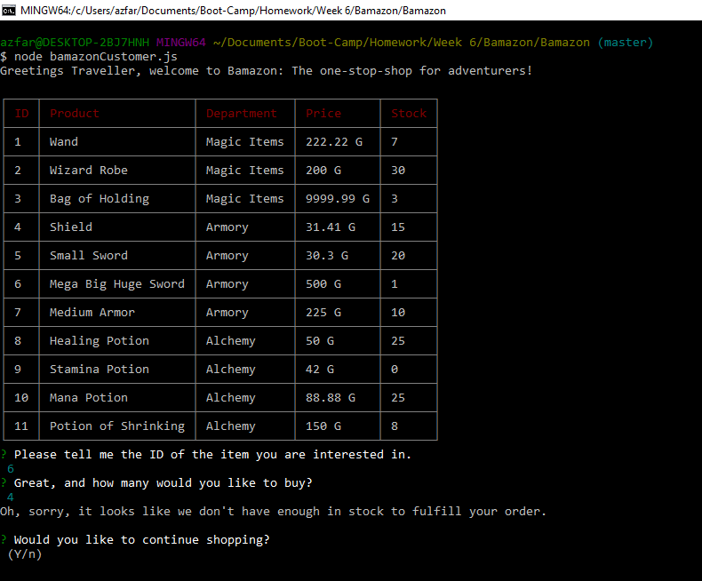
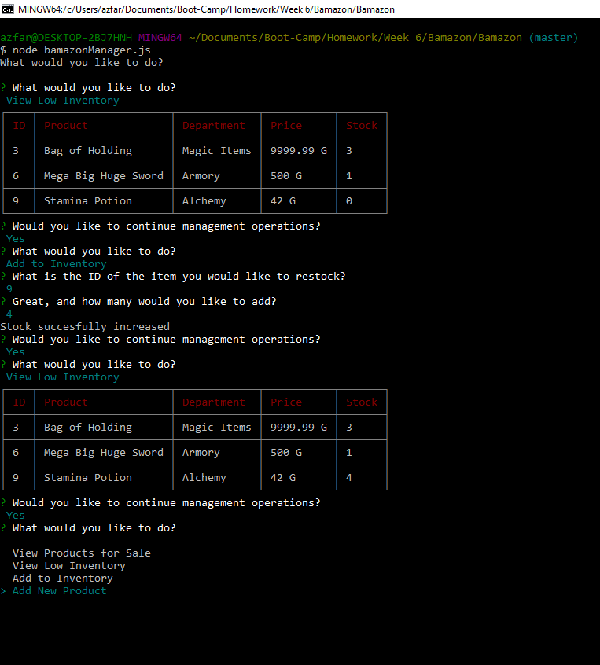

# Fantasy Shop
Bamazon is a text based shop simulator and manager running entirely on the backend using Node, and handling inventory using MySQL. This rendition of the Fantasy Shop has two modes, Shop Customer and Shop Manager. The former can be used to purchase items from the store, and the latter can be used to manage the store's inventory.

# Prerequisites
- [node.js](https://nodejs.org/en/)
- [Git Bash](https://git-scm.com/downloads)
- [MySQL Community Server and Workbench](https://dev.mysql.com/downloads/mysql/)

# Installation guide
- First you will need to download this folder to your computer. You may do this either by downloading the document as a zip file, or by cloning the git repository to a folder on your computer using Git Bash. In order to do this, click the green button labeled "Clone or Download", and select your method of retrieving the file.
- If you want to use the git clone method, your first step is to copy the link provided. From here you want to navigate to the desired location on your computer in your Git Bash terminal, or navigate to the desired location via your explorer, right click and select "Git Bash Here". Within your Git Bash terminal, type the following: 
`git clone https://github.com/aehaq/Fantasy-Shop.git`
- Once the repository exists locally on your computer, navigate to within the newly downloaded folder using git bash, or use the "Git Bash Here" method to open the terminal within the correct folder.
- To ensure you are in the correct folder, type the following and hit enter: 
`ls`
- If successful, all non-hidden documents and folders within your location should be listed. If this includes a file named 'bamazonCustomer.js', you are in the right place.
- Finally, you will need to ensure that all of the required npm packages are installed. Type the following phrase into your Git Bash terminal: 
`npm install`
- If successful you should see a progress bar within the Git Bash terminal indicating installation progress. If this method does not work, try inputing the following commands next.

`npm install inquirer`

`npm install cli-table`
- After succesfully installing packages, make sure to run the bamazon.sql file in your MySql workbench to create the database.

# Use
To get Started with the application, you simply need to run the javascript file in your terminal using Node. You have two files you can interact with in Node, as displayed below.

## Bamazon Customer

- Now that you are in the right place type the following command into your terminal to run the bamazon customer file, then hit enter.
`node bamazonCustomer.js`
- As a customer you can look at the Inventory available, and make purchases. Feel free to play around with the system as much as you like. You will be prevented from ordering more of an item than the item has in stock, or attempting to purchase items not currently on the list. When you are done playing around with this, feel free to move over to Bamazon Manager for additional options. Simply respond that you are not interested in continuing shopping when you are done, or type `Ctrl+C`, to exit.

## Bamazon Manager

- When you have returned to the command line in the file, type the following command into your terminal to run the bamazon manager file, then hit enter.
`node bamazonManager.js`
- As a manager, you are prompted with a variety of options to interact with the inventory. In addition to viewing the inventory, you can view low stock items and increase their stock as you see fit. You can also add entirely new items to the store as you see fit.

# Technology Used
- JavaScript (Node.js)
- Node Packages (inquirer.js, mysql, cli-table)
- MySQL & MySQL workbench.

# Code Snippets
```
function addInventory() {
    inquirer.prompt([
        {
            message: "What is the ID of the item you would like to restock? \n",
            name: "item"
        },
        {
            message: "Great, and how many would you like to add? \n",
            name: "quantity"
        }
    ]).then(function(response) {
        var quant = parseInt(response.quantity);
        var itemNum = parseInt(response.item) - 1;

        var query = connection.query('SELECT * FROM products', function (err, res) {
            var item = res[itemNum];
            var stock = parseInt(item.stock_quantity);
    
            if (!item) {
                console.log("I'm sorry, but no item with that ID exists. \n");
            } else {
                increaseStock(item, stock, quant);
            }
        })
    });
}


function increaseStock(item, stock, quant) {
    var newQuant = stock + quant;
    var id = item.item_id;
    var query = connection.query('UPDATE products SET ? WHERE ?',
    [
        {
            stock_quantity: newQuant
        },
        {
            item_id: id
        }
    ],
    function(err, res) {
        console.log("Stock succesfully increased")
        continueQuery();
    }
    );
}
```
These two functions are used when adding inventory to the shop in Bamazon Manager. 

The first function handles the user's request. First it runs inquirer to ask the user for two pieces of information: the Id of the item they would like to add to the store, and the amount of that item they would like to stock. The former is necessary to locate the item from within the database, and the latter is necessary to make the changes. In order to work with this information, we must first format these items as integers and reduce the item id by 1 so that we may access the relevant item object from the array the database will provide us. We connect to the database, use the converted item id to retrieve the object and then pass the relevant information to our second function.

The second function takes the item, it's stock and the quantity we would like to add to the object and uses that data to alter the information stored in the database. It is worth noting that with the item object passed into the function, passing the stock into this function is not necessary either. Despite this, I chose to pass the stock into the function before calling it so as to simplify and clarify the function's use. Once we pass all of this data into the function, we calculate the updated stock based off of the old stock and quantity added, then reference the database for an update. We update the database at the location of the item id retrieved from the item object, and set the stock to be equal to the newly calculated quantity.

# Learning Points
- Creating databases and tables using MySQL Workbench.
- Connecting to, reading, and updating a MySQL Database using Javascript.
- Understanding how to use Functions along with Node Packages to carefully manage synchronicity when interacting with JavaScript.
- Nesting functions within MySql connection queries to pass them information stored within the database.
- Using SwitchCase to call functions based on complex inputs tied to inquirer prompts.
- Managing visual appearance of terminal based applications with visuals-oriented Node Packages.

# Author 
Azfar Haq - [GitHub](https://github.com/aehaq)

# License
Standard MIT License
